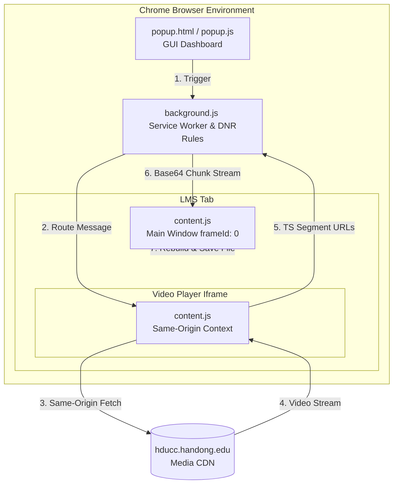

# 🛡️ Dark Knight Project - Technical Reports & Study Guides

To provide a cleaner, more readable, and structured study experience, the comprehensive troubleshooting and technical reports have been separated into dedicated Korean and English documents.

이 보고서는 대학 학습 관리 시스템(LMS) 및 ReadyStream 미디어 서비스의 웹 보안 장벽을 우회하는 과정에서 겪은 수많은 기술적 오류와 아키텍처 발달사를 공부하기 편하게 한국어 및 영어 버전으로 각각 분리하여 제공합니다.

---

## 📂 Available Reports (보고서 링크)

### 🇰🇷 한글 버전 (Korean Version)
- **[보고서 읽기 (report_ko.md)](file:///c:/Users/_%20%EB%8C%80%20%EC%84%B1/Desktop/%EC%99%B8%EC%A3%BC/dark-knight/report_ko.md)**
- **주요 내용**: 
  - 개발 발단 및 아키텍처 진화 (v1.0 -> v3.0)
  - 15바이트 다운로드 실패 에러 및 403 Forbidden 해결법
  - Mixed Content 정책 우회 및 HTTP -> HTTPS 자동 정규화
  - `tabIds: [-1]` 설정을 통한 일반 탭 세션 만료 및 오염 방지
  - Structured Clone 한계 극복을 위한 Base64 청크 스트리밍 기법
  - Iframe Sandbox 다운로드 제한을 피하기 위한 최상위 메인 프레임(`frameId: 0`) 다운로드 위임
  - `executeWithMultiBypasses` 규칙 공백(Rule Gap) 장애 분석 및 생명주기 분리 설계
  - CORS, CSP, SameSite, DNR 웹 보안 기초 정리 및 SaaS 상용화 로드맵

### 🇺🇸 영어 버전 (English Version)
- **[Read the Report (report_en.md)](file:///c:/Users/_%20%EB%8C%80%20%EC%84%B1/Desktop/%EC%99%B8%EC%A3%BC/dark-knight/report_en.md)**
- **Key Highlights**:
  - Background & Evolution of Dark Knight's architecture (v1.0 to v3.0)
  - Resolving the 15-Byte "Access Denied" and 403 Forbidden issues
  - Bypassing the Mixed Content Policy using automated HTTPS normalization
  - Isolating DNR rules using `tabIds: [-1]` to prevent LMS tab session expiration
  - Preventing memory crashes and Structured Clone limits via Base64 chunk streaming
  - Resolving Iframe Sandbox constraints by delegating discharge to the top-level main frame (`frameId: 0`)
  - Fixing the Rule Gap race condition using separated rule registration/removal lifecycles
  - Clear explanations of CORS, CSP, SameSite, DNR, and SaaS architectural designs

---

## 🛠️ System Architecture Diagram (시스템 아키텍처 요약)

---
*Created by Antigravity (Advanced Coding AI Agent) on June 8, 2026.*
