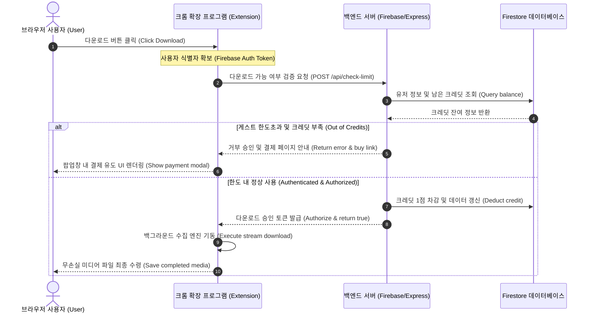

# 학습 보고서: 웹 보안 아키텍처 및 크롬 확장 프로그램 통신 매커니즘 분석
# Study Report: Web Security Architecture & Chrome Extension Network Mechanics

본 보고서는 학습 관리 시스템(LMS) 및 웹 미디어 보안 인프라를 분석하고, 크롬 확장 프로그램(Chrome Extension) 환경에서 발생할 수 있는 주요 웹 보안 제약 사항(CORS, CSP, SameSite Cookies, Referer 검증)과 이에 대한 교과서적 해결 메커니즘을 상세히 다룹니다.

This report analyzes Web Media Security Infrastructures and documents the key web security constraints (CORS, CSP, SameSite Cookies, Referer Validation) encountered within the Chrome Extension environment, along with their academic and architectural resolution mechanisms.

---

## 목차 (Table of Contents)
1. **CORS (Cross-Origin Resource Sharing) / 교차 출처 자원 공유**
2. **CSP (Content Security Policy) / 콘텐츠 보안 정책**
3. **SameSite Cookies / 세션 인증 쿠키 규격**
4. **Referer & Origin Spoofing / 네트워크 헤더 검증**
5. **Dynamic DeclarativeNetRequest (DNR) / 동적 네트워크 제어**
6. **SaaS 비즈니스 모델로의 전환을 위한 아키텍처 설계 (SaaS Architecture Design)**

---

## 1. CORS (Cross-Origin Resource Sharing)
### [KR] 교차 출처 자원 공유 개요
CORS는 웹 브라우저가 현재 로드된 웹 페이지의 출처(Origin)와 다른 출처(도메인, 프로토콜, 포트)에서 호스팅되는 자원에 접근하는 것을 보안상 제한하는 규격입니다.
* **원인**: 기본적으로 브라우저는 '동일 출처 정책(Same-Origin Policy)'을 따릅니다. 만약 `https://lms.handong.edu`에서 구동되는 스크립트가 임의로 `https://hducc.handong.edu`의 자원에 접근하려 하면, 상대 서버가 응답 헤더에 `Access-Control-Allow-Origin`을 명시하여 해당 출처를 허용해 주지 않는 한 브라우저 단에서 요청이 강제 차단됩니다.
* **해결 매커니즘**:
  1. **동일 출처 맥락 활용**: 통신을 요청하는 주체를 자원이 실제 호스팅되는 도메인(Same-Origin)으로 이전시킵니다 (예: `hducc.handong.edu` 하위의 iframe 내에서 직접 요청 수행).
  2. **특권 컨텍스트 활용**: 크롬 확장 프로그램의 백그라운드 서비스 워커(Service Worker)는 브라우저의 도메인 샌드박스 외부에 존재하며, `manifest.json`에 `host_permissions`가 부여되어 있으면 CORS 제약 없이 자유롭게 외부 API와 통신할 수 있습니다.

### [EN] Overview of Cross-Origin Resource Sharing
CORS is a web standard that restricts a web page from making requests to a domain different from the one that served the web page.
* **Cause**: By default, browsers enforce the Same-Origin Policy (SOP). If a script running on `https://lms.handong.edu` tries to access resources on `https://hducc.handong.edu`, the browser blocks the response unless the target server explicitly includes the `Access-Control-Allow-Origin` header permitting the requesting origin.
* **Resolution Mechanics**:
  1. **Same-Origin Context Redirection**: Moving the communication initiator to the exact domain where the resource is hosted (e.g., executing the fetch inside the player iframe under `hducc.handong.edu`).
  2. **Privileged Context Isolation**: Chrome Extension Background Service Workers reside outside the standard browser origin sandbox. Provided they have correct `host_permissions` in `manifest.json`, they can fetch cross-origin resources without CORS restrictions.

---

## 2. CSP (Content Security Policy)
### [KR] 콘텐츠 보안 정책과 connect-src
CSP는 교차 사이트 스크립팅(XSS) 및 데이터 인젝션 공격을 예방하기 위해 웹 서버가 브라우저에 하달하는 지시 헤더입니다.
* **원인**: CSP의 `connect-src` 지침은 스크립트(`fetch`, `XMLHttpRequest`)가 연결할 수 있는 목적지 도메인을 엄격히 화이트리스트로 제한합니다. Manifest V3 환경에서는 웹 페이지에 삽입되는 컨텐트 스크립트(`content.js`) 역시 해당 웹 페이지에 설정된 CSP의 제한을 그대로 적용받습니다. 따라서 타 도메인의 동영상 서버로 fetch를 시도할 경우 `TypeError: Failed to fetch` 에러와 함께 네트워크 접속 자체가 차단됩니다.
* **해결 매커니즘**: 웹 페이지 컨텍스트에 귀속되지 않는 독립적 환경인 **백그라운드 서비스 워커(`background.js`)**로 fetch 작업을 전적으로 이관함으로써 웹 페이지에 설정된 강력한 CSP의 눈을 완벽하게 피해 갈 수 있습니다.

### [EN] Content Security Policy & connect-src
CSP is a security header designed to detect and mitigate site vulnerabilities, including Cross-Site Scripting (XSS) and data injection attacks.
* **Cause**: The `connect-src` directive restricts the target URLs to which scripts (via `fetch` or `XMLHttpRequest`) are allowed to connect. Under Manifest V3, Content Scripts (`content.js`) running in isolated worlds are still bound by the host page's CSP. Attempting to fetch a video file on a restricted domain results in a `TypeError: Failed to fetch` CSP violation.
* **Resolution Mechanics**: Offloading the programmatic HTTP request to the **Background Service Worker (`background.js`)** bypasses the page-level CSP completely because the service worker operates in an isolated system-level context.

---

## 3. SameSite Cookies
### [KR] 세션 인증 쿠키의 SameSite 제한
SameSite 쿠키 정책은 크로스 사이트(Cross-Site) 요청 시 쿠키가 전송되는 방식을 제어하여 CSRF(Cross-Site Request Forgery) 공격을 방어합니다.
* **원인**: 쿠키 속성이 `SameSite=Lax` 또는 `SameSite=Strict`로 설정되어 있으면, 제3의 도메인(예: 확장 프로그램 팝업창인 `chrome-extension://...`)에서 전송되는 요청에는 해당 도메인의 로그인 세션 쿠키가 온전히 전달되지 않습니다. 이로 인해 영상 주소를 정확히 맞추어 호출하더라도 서버는 권한이 없는 게스트로 인식하여 `403 Forbidden` 에러를 반환합니다.
* **해결 매커니즘**:
  1. **동일 출처 iframe 위임**: 영상 서버와 도메인이 일치하는 iframe의 동일 출처 맥락에서 fetch를 수행하여 자연스럽게 브라우저가 쿠키를 태워 보내도록 만듭니다.
  2. **백그라운드 쿠키 동적 수집**: 확장 프로그램 전용 `chrome.cookies` API를 활용하여 브라우저 저장소에서 해당 도메인 및 상위 와일드카드 도메인(예: `.handong.edu`)의 모든 인증용 쿠키들을 직접 긁어모은 후, 이를 요청 헤더에 문자열로 직접 조립하여 전송하는 우회 방식을 취합니다.

### [EN] SameSite Restrictions on Authentication Cookies
SameSite cookie policies prevent Cross-Site Request Forgery (CSRF) by controlling how cookies are attached to cross-site requests.
* **Cause**: If session cookies are marked as `SameSite=Lax` or `SameSite=Strict`, they are stripped by the browser when a request is initiated from a cross-site context (such as the extension popup origin `chrome-extension://...`). The video server sees an unauthenticated client and responds with a `403 Forbidden` status code.
* **Resolution Mechanics**:
  1. **Same-Origin Iframe Delegation**: Running the network request inside the same-domain iframe so that the browser implicitly includes the SameSite cookies.
  2. **Dynamic Programmatic Cookie Extraction**: Utilizing the privileged `chrome.cookies` API within the extension to query the cookie store for target and wildcard parent domains (e.g., `.handong.edu`), assembling them into a raw cookie string, and manually appending them to the request headers.

---

## 4. Referer & Origin Spoofing
### [KR] 네트워크 헤더 검증
상당수의 고성능 미디어 배포 인프라 및 CDN은 불법 콘텐츠 유출(핫링크)을 차단하기 위해 HTTP `Referer`(이전 페이지 주소)와 `Origin` 헤더를 검사합니다.
* **원인**: 직접 다운로드를 수행할 때 `Referer` 값이 유실되거나 확장 프로그램 주소(`chrome-extension://...`)로 표기되면, 동영상 서버는 정당한 플레이어(HTML5 Player) 환경에서 로드된 요청이 아니라고 판단하여 다운로드를 거부(15바이트 수준의 Access Denied 페이지로 강제 대체 및 리다이렉트)시킵니다.
* **해결 매커니즘**: 웹 브라우저 최하단의 네트워크 스택에 직접 침투하여 요청이 전송되기 직전에 헤더를 가로채 변조하는 **`declarativeNetRequest`** 또는 **`webRequest`** 기술을 통해 가상의 타겟 뷰어 URL(`Referer`)과 오리진 도메인(`Origin`)을 정교하게 속여 보냅니다.

### [EN] Network Header Verification (Referer & Origin)
Media distribution networks and CDNs evaluate the HTTP `Referer` and `Origin` headers to protect digital intellectual property and block hotlinking.
* **Cause**: If the `Referer` is empty or displays the extension's scheme (`chrome-extension://...`), the media host identifies it as an automated script and drops the connection, returning a lightweight "Access Denied" payload (exactly 15 bytes) instead of the actual media.
* **Resolution Mechanics**: Intercepting and altering outgoing HTTP request headers at the browser's lowest network layer using the **`declarativeNetRequest`** API to inject simulated target viewer URLs (`Referer`) and origin values.

---

## 5. Dynamic DeclarativeNetRequest (DNR)
### [KR] Manifest V3의 동적 규칙 및 라이프사이클 관리
Manifest V3 표준에서는 성능 및 사용자 프라이버시 보호를 위해 구 버전의 `webRequestBlocking` 대신 선언형 헤더 변조 기술인 `declarativeNetRequest`를 적극 채택하고 있습니다.
* **원리**: 정적 규칙 파일(`rules.json`)은 고정된 도메인 규칙만 처리할 수 있어 수시로 변하는 인증 토큰이나 쿠키 정보를 동적으로 담아낼 수 없습니다. 따라서 `chrome.declarativeNetRequest.updateDynamicRules` API를 통하여 메모리상에 런타임으로 새로운 헤더 변조 규칙(우선순위 100 이상 지정)을 주입한 뒤, 다운로드가 끝나면 즉시 해당 규칙을 파괴하여 일반적인 브라우징에 영향을 끼치지 않도록 철저히 관리합니다.

### [EN] Dynamic DeclarativeNetRequest (DNR) in MV3
Manifest V3 replaces the legacy blocking `webRequest` API with the declarative, privacy-preserving `declarativeNetRequest` API.
* **Mechanics**: Static rule files cannot represent dynamic runtime data like active session cookie strings. Therefore, the extension leverages `chrome.declarativeNetRequest.updateDynamicRules` to dynamically inject high-priority rules (Priority 100+) targeting the exact media endpoint at runtime. Upon download completion, these rules are dynamically destroyed (Clean-up) to avoid overhead or interference with ordinary browsing activities.

---

## 6. SaaS 비즈니스 모델로의 전환을 위한 아키텍처 설계
대표님이 기획하고 계신 **상용화 서비스(게스트 무료 3회 제공 후 유료 크레딧 차감제)**를 성공적이고 보안성 높게 구축하기 위해 향후 적용해야 할 안전한 SaaS 통제 시스템 가이드를 제시합니다.

To scale this prototype into a viable commercial SaaS model (Guest limits & Credit deduction), the extension must transition from client-side execution to a secure, serverless backend.

### [KR] 핵심 구현 가이드라인
1. **서버리스 백엔드 결합 (Firebase Auth + Cloud Functions)**:
   - 보안 및 결제 정보를 로컬 확장 프로그램 스토리지에 보관하면 사용자가 마음대로 스크립트를 조작해 무제한 무료 복제가 가능해집니다.
   - 확장 프로그램 내부에서 구글 아이디 등으로 로그인(Firebase Auth)을 거친 후, 영상 다운로드 시작 전에 데이터베이스(Firestore)를 조회하는 보안 검증 단계를 반드시 추가해야 합니다.
2. **서버 사이드 다운로드 대행 (Proxy Downloader) 고려**:
   - 확장 프로그램 내의 핵심 보안 우회 연동 코드가 외부에 노출되는 것을 막기 위해, 수집 로직 자체를 AWS Lambda나 Cloud Functions와 같은 백엔드 환경으로 이전시켜 최종 `.mp4` 완성본 바이너리만 클라이언트에 전송하는 구조를 고려해 볼 수 있습니다.

### [EN] SaaS Implementation Guidelines
1. **Serverless Backend Integration (Firebase Auth & Cloud Functions)**:
   - Storing payment status or daily balance client-side allows users to bypass limits by altering Chrome local storage. 
   - Authentication via Firebase Auth combined with remote API balance checks against Firestore is vital before initiating the download.
2. **Server-Side Proxy Downloader Architecture**:
   - To prevent proprietary extraction mechanisms and spoofing scripts from being exposed in client-side extension builds, offloading the media assembly logic to serverless runtimes (like AWS Lambda) is recommended. The backend serves the compiled `.mp4` securely to authorized extension instances.
