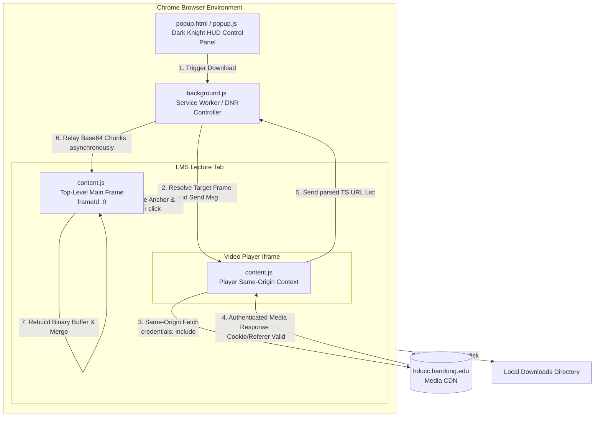

# 📖 Dark Knight Project: Web Media Security Infrastructure Bypass & Technical Troubleshooting Comprehensive Report

This report is a comprehensive academic and technical study documenting the **technical errors, blockages, root causes, and architectural solutions** encountered during the development of the Chrome Extension designed to bypass Web Security Barriers of university Learning Management Systems (LMS) and ReadyStream media servers to securely download original lecture videos (.mp4 / .ts).

---

## 🗂️ Table of Contents

1. **Project Development Timeline & Troubleshooting Overview**
2. **Detailed Analysis of Key Issues & Solutions (Deep Dive)**
   - 2.1 Issue 1: The 15-Byte Barrier (Access Denied / 403 Forbidden)
   - 2.2 Issue 2: Mixed Content Policy Block (Failed to Fetch at 15% progress)
   - 2.3 Issue 3: Tab Session Poisoning & Forced Logouts (Failed to Fetch at 5% progress)
   - 2.4 Issue 4: Large Binary Transfer Limits & Memory Crashes (Structured Clone & OOM)
   - 2.5 Issue 5: Iframe Sandbox Download Constraints
   - 2.6 Issue 6: Intermittent Download Failures (The Rule Gap Bug)
3. **Core Bypass Mechanisms & Architecture Diagrams**
   - 3.1 Same-Origin Context Delegation
   - 3.2 Separated Rule Lifecycle Management
4. **Study Guide: Web Security Concepts (CORS, CSP, SameSite, DNR)**
5. **Commercialization Strategy: Security & Billing SaaS Architecture**

---

## 1. Project Development Timeline & Troubleshooting Overview

During the project development lifecycle, starting from simple fetch attempts, the extension met various layered web security systems enforced by the browser and the target servers. This caused the download process to crash at different milestones. The extension's architecture evolved through iterative bug hunting, progressing from **v1.0 (Simple Client-Side Fetch) -> v2.0 (DNR Header Manipulation) -> v3.0 (Same-Origin Delegation & Explicit Rule Lifecycles)**.

### Troubleshooting Summary Table

| Error / Failure Point | Technical Error Code | Root Cause | Architectural Resolution |
| :--- | :--- | :--- | :--- |
| **Downloads a 15-byte file** | `403 Forbidden` (Access Denied) | Missing Referer header and omitted Session Cookies on Cross-Origin requests | Programmed dynamic DNR rules to inject Referer/Origin headers and delegated file discharge to the top-level main frame (`frameId: 0`). |
| **HLS freezes at 15%** | `TypeError: Failed to Fetch` | Mixed Content block due to insecure `http://` TS segment requests sent from a secure extension context | Built `ensureHttps()` to force-rewrite all URLs to HTTPS before sending network requests. |
| **HLS freezes at 5% & logs out user** | `Failed to Fetch` & `Session Expired` | Overbroad DNR rule matching applying session modifications to the student's normal browser tabs | Specified `tabIds: [-1]` in DNR rule conditions to strictly isolate header changes to the service worker context. |
| **Tab/Extension crashes on large merges** | `Out of Memory` / Serialization failure | Heavy memory overhead and Structured Clone limits when transmitting large `ArrayBuffer` data via message passing | Relayed only TS URL lists to the background worker, which streamed the chunks as Base64 strings to the main frame's local memory spooler. |
| **Downloads blocked in iframe** | `Sandbox restriction: downloads...` | LMS player iframe sandbox properties (`sandbox="allow-scripts allow-same-origin"`) blocking file writing | Executed TS download and buffer compilation inside the background/main context, triggering the final download anchor on `frameId: 0`. |
| **Intermittent 5% / 15% failures** | `403 Forbidden` (Non-deterministic) | A race condition called the **Rule Gap Bug** where DNR rules were removed by a decorator's `finally` block before subsequent fetches began | Replaced the `executeWithMultiBypasses` decorator pattern with explicit, persistent `setupDownloadRules()` and `clearDownloadRules()`. |

---

## 2. Detailed Analysis of Key Issues & Solutions (Deep Dive)

### 2.1 Issue 1: The 15-Byte Barrier (Access Denied / 403 Forbidden)
* **Symptom**: When trying to download MP4 files hosted on Naver Cloud CDN (`naverncp.com`) or university media servers (`hducc.handong.edu`), the download completed immediately but generated a corrupted **15-byte** file. Opening this file in a text editor revealed a single line: `Access Denied`.
* **Root Cause**:
  1. The CDN/media server validates the `Referer` and session cookies to protect media from unauthorized hotlinking.
  2. When triggering `fetch()` directly from the popup or background service worker, or invoking `chrome.downloads.download`, the request's origin was set to `chrome-extension://[ID]`, with the `Referer` header missing.
  3. Chrome's `SameSite=Lax` cookie policy also stripped the student's active authentication cookies because the request originated from a different site.
  4. The server rejected the request with `403 Forbidden` and responded with a 15-byte text payload: `Access Denied`. The Chrome downloads API saved this HTML error body as the video file.
* **Resolution**:
  - **DNR (declarativeNetRequest) Header Injection**: Registered dynamic rules to spoof `Referer` to `https://lms.handong.edu/` and `Origin` to `https://lms.handong.edu` for all requests heading to `hducc.handong.edu`.
  - **Same-Origin Context Delegation**: Programmed the extension to pass download requests to a content script (`content.js`) running inside the player iframe, forcing the browser to treat the fetch as a same-origin call with correct session credentials automatically attached.

---

### 2.2 Issue 2: Mixed Content Policy Block (Failed to Fetch at 15% progress)
* **Symptom**: During HLS (M3U8) downloads, the process immediately aborted at 15% (the start of TS chunk retrieval) with a generic `TypeError: Failed to fetch` error.
* **Root Cause**:
  1. The target server's M3U8 index contained absolute segment URLs using the insecure HTTP protocol (`http://hducc.handong.edu/...`).
  2. The Chrome Extension environment operates as a Secure Context (`chrome-extension://`). According to the W3C **Mixed Content Policy**, modern browsers strictly block attempts to fetch insecure resources (`http://`) from secure contexts to prevent man-in-the-middle attacks.
  3. Because the browser blocked the request locally before it hit the network card, no HTTP status code was returned, resulting in a generic `TypeError`.
* **Resolution**:
  - Implemented the `ensureHttps()` helper utility to intercept and sanitize all media URLs before calling `fetch`.
  ```javascript
  function ensureHttps(url) {
    if (typeof url !== 'string') return url;
    return url.startsWith('http://') ? url.replace('http://', 'https://') : url;
  }
  ```
  - Since the CDN supported both protocols, force-converting the scheme to HTTPS resolved the mixed-content block.

---

### 2.3 Issue 3: Tab Session Poisoning & Forced Logouts (Failed to Fetch at 5% progress)
* **Symptom**: During download runs, the progress bar froze at 5%, and the user's active browser tab displaying the LMS logged out with a "Session Expired" alert.
* **Root Cause**:
  1. To download segments, the background worker dynamically registered DNR rules to inject session cookies and referers.
  2. However, the rule condition omitted a tab filter, causing the rule to match **every single network call browser-wide** destined for the LMS.
  3. Consequently, the user's normal browsing requests had their session headers overwritten by the downloader's cached cookie snapshots, leading the LMS server to flag the session as hijacked and invalidate it.
  4. The session invalidation destroyed the credentials used by the background downloader, causing the download to fail.
* **Resolution**:
  - Constrained DNR dynamic rules to target only network requests initiated by the background service worker itself using the **`tabIds: [-1]`** condition.
  ```javascript
  condition: {
    urlFilter: "||" + hostname,
    tabIds: [-1], // Restricts rule scope exclusively to the background worker context
    resourceTypes: ["xmlhttprequest", "other"]
  }
  ```
  - This prevented normal student tabs from having their headers modified, preserving active login states.

---

### 2.4 Issue 4: Large Binary Transfer Limits & Memory Crashes (Structured Clone & OOM)
* **Symptom**: While downloading lectures longer than 1 hour, the extension crashed with an `Out of Memory` (OOM) error, or message passing failed during buffer compilation.
* **Root Cause**:
  1. The original pipeline downloaded and compiled all TS fragments inside the iframe's `content.js` and sent the compiled `ArrayBuffer` to the background worker or main frame using `chrome.runtime.sendMessage`.
  2. Browser message channels utilize the **Structured Clone Algorithm** to serialize objects. Cloning hundreds of megabytes of video binary data duplicated the heap usage, exceeding memory limits and crashing the extension processes.
* **Resolution**:
  - **Refactored Data Flow**: Moved the TS fetching workload from the iframe context to the background worker.
  - The iframe's `content.js` parses the M3U8 stream to extract segment URLs and sends them as lightweight JSON text.
  - The background worker downloads the chunks, decrypts them, and streams them as small **Base64-encoded strings** to the main frame (`frameId: 0`) in small batches. The main frame caches these chunks in a local array and merges them to Blob only at the final assembly phase, avoiding serialization memory spikes.

---

### 2.5 Issue 5: Iframe Sandbox Download Constraints
* **Symptom**: Even after successfully fetching and merging TS segments in the iframe's `content.js`, attempting to download the file by creating and clicking an anchor link (`<a>`) triggered the browser error: `Sandbox restriction: downloads are blocked inside sandboxed iframes`.
* **Root Cause**:
  - The LMS embeds the video player using an iframe marked with `sandbox="allow-scripts allow-same-origin"`.
  - For security, browsers prevent sandboxed iframe contexts from triggering local file writes (`download` attribute clicks).
* **Resolution**:
  - **Main Frame Download Dispatch**:
  - Relayed the assembled binary metadata to the top-level main frame (`frameId: 0`), which runs outside the sandbox constraint.
  - The main frame script instantiates the Object URL and programmatically clicks a temporary download anchor, saving the file to the local disk.

---

### 2.6 Issue 6: Intermittent Download Failures (The Rule Gap Bug)
* **Symptom**: Despite implementing Phase 14 and 15 patches, downloads randomly aborted at 5% or 15% on some runs but worked on others.
* **Root Cause**:
  - The DNR configuration used an asynchronous decorator function `executeWithMultiBypasses(urls, referer, actionCallback)`:
    ```javascript
    async function executeWithMultiBypasses(urls, referer, actionCallback) {
      await chrome.declarativeNetRequest.updateSessionRules({ addRules: newRules }); // Register
      try {
        return await actionCallback();
      } finally {
        await chrome.declarativeNetRequest.updateSessionRules({ removeRuleIds: ... }); // Remove immediately
      }
    }
    ```
  - The background downloader made two separate sequential calls to this decorator:
    1. **First call**: Fetch and parse the M3U8 playlist. The rule was immediately removed in the `finally` block upon completion.
    2. **Async rule-free gap**: A small asynchronous latency existed before the second call registered rules for the TS segments.
    3. **Second call**: Fetch the TS segments.
  - During this rule-free **Rule Gap**, the browser dispatched queued network requests that lacked the required headers, triggering a `403 Forbidden` response from the server.

```mermaid
sequenceDiagram
    participant App as Downloader Engine
    participant DNR as declarativeNetRequest Engine
    participant Net as Browser Network Thread
    participant Server as Media Server (hducc)

    Note over App, DNR: [Structural Defect: Decorator Rule Gap Pattern]
    App->>DNR: 1. updateSessionRules (Register Bypass Rules A)
    App->>Net: 2. fetch(Request M3U8 Playlist)
    Net->>Server: [Bypass Active] Sent with Cookie/Referer
    Server-->>Net: Respond with M3U8 playlist
    App->>DNR: 3. [Finally Block] Remove Bypass Rules A
    Note over DNR, Net: ⚠️ No rules active during Rule Gap latency!
    
    rect rgb(45, 15, 15)
        Note over Net: Queued segment fetch goes out during the gap
        Net->>Server: [No Bypass] Sent from chrome-extension Origin
        Server-->>Net: ❌ 403 Forbidden (Access Denied)
    end

    App->>DNR: 4. updateSessionRules (Register Bypass Rules B)
    App->>Net: 5. fetch(Request TS segments)
```



* **Resolution**:
  - Replaced the decorator pattern with explicit, persistent lifecycle states: `setupDownloadRules(urls)` and `clearDownloadRules()`.
  - The rules remain active continuously from the start of the M3U8 request until the last TS segment is stored, and are only removed once the file is fully saved.

---

## 3. Core Bypass Mechanisms & Architecture Diagrams

### 3.1 Same-Origin Context Delegation & Main Frame Relay Architecture



---

## 4. Study Guide: Web Security Concepts (CORS, CSP, SameSite, DNR)

### 4.1 CORS (Cross-Origin Resource Sharing)
* **Definition**: A security mechanism enforced by browsers to prevent scripts on one origin (e.g., `A.com`) from reading resources on another origin (e.g., `B.com`) unless `B.com` explicitly permits it by returning the header `Access-Control-Allow-Origin`.
* **Key Learning**: While Chrome Extension background workers have relaxed cross-origin permissions, injected content scripts are bound by the page's CORS policy. Injecting a content script into a same-origin player iframe allows the extension to leverage native same-origin permissions to fetch resources without manual header adjustments.

### 4.2 CSP (Content Security Policy)
* **Definition**: An HTTP header sent by web servers to restrict the resources (JavaScript, CSS, Connections) a page is allowed to load or interact with, preventing Cross-Site Scripting (XSS) attacks.
* **Key Learning**: CSP policies apply to the web page document, meaning injected content scripts are limited by the host's `connect-src` rules. However, Extension Service Workers operate in an isolated environment outside the webpage DOM and bypass the host page's CSP, allowing them to fetch from any domain declared in `host_permissions`.

### 4.3 SameSite Cookies
* **Definition**: A cookie attribute that prevents browsers from sending cookies along with cross-site requests (e.g., links, fetches originating from external domains) to mitigate Cross-Site Request Forgery (CSRF). `SameSite=Lax` is the default browser standard.
* **Key Learning**: Extensions cannot attach session cookies to cross-origin fetches by simply using `credentials: 'include'`. The extension must query the browser's cookie jar via `chrome.cookies.getAll` and inject the cookies using lower-level network APIs (`chrome.declarativeNetRequest`).

---

## 5. Commercialization Strategy: Security & Billing SaaS Architecture

The current Dark Knight prototype operates as a local, client-side MVP. To scale this prototype into a commercial SaaS product with a credit system (e.g., 3 free guest downloads, then paid access), the control flow must be moved to a secure backend.

### 5.1 Preventing Client-Side Manipulation
* **Vulnerability**: In a client-side architecture, all code runs on the user's computer. Storing credit counters or purchase history in `chrome.storage.local` allows users to modify these values using the F12 developer console or reinstall the extension to reset limitations.
* **Security Standard**: All authorization, credit validation, and usage decrements must be handled exclusively by a remote backend server.

### 5.2 Firebase Auth + Firestore Database Integration
1. **Google Firebase Auth**: Embed a Google Auth flow in `popup.js` to sign up users and retrieve a secure JWT (JSON Web Token) identifying their UID.
2. **Cloud Firestore Database**: Create a `users` collection storing each UID's credit balance and daily usage counter.
3. **Cloud Functions for API Validation**: Before starting a download, the extension sends a POST request with the user's JWT and the target video URL to a secure API endpoint (`Firebase Cloud Functions`). The function performs a transactional check to verify the credit balance, decrements it by 1 point, and returns a signed transaction token. The extension only proceeds with the download if a valid backend token is returned.

### 5.3 AWS Lambda Server-Side Proxy Downloader
* Keeping the downloader logic inside the extension makes the code vulnerable to reverse engineering. Competitors can inspect the extension's files and steal the extraction algorithms.
* **Server-Side Proxy Architecture**:
  - The extension is only responsible for sniffing the page and sending the video URL and authentication cookies to a serverless backend (AWS Lambda).
  - The AWS Lambda instance fetches the media segments on high-bandwidth servers and merges them into a clean `.mp4` file.
  - The server uploads the completed file to a secure storage bucket (AWS S3) and returns a secure, temporary Signed URL (valid for 1 hour) to the extension popup, letting the client download it directly.
  - This architecture protects proprietary code from being copied and prevents local machine performance bottlenecks.

---
Documented by: **Antigravity (Advanced Coding AI Agent)**
Date: **June 8, 2026**
Target Audience: **Lead Developer & Founder of the Dark Knight Project**
