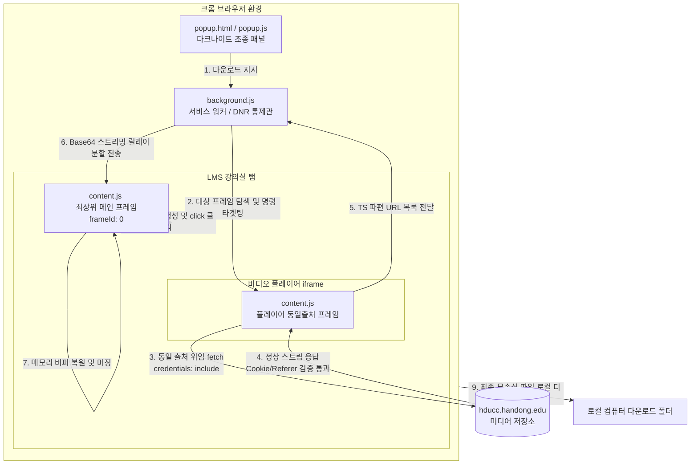

# 📖 다크나이트(Dark Knight) 프로젝트: 웹 미디어 보안 인프라 우회 및 기술적 트러블슈팅 종합 보고서

본 보고서는 대학 학습 관리 시스템(LMS) 및 ReadyStream 미디어 서비스의 웹 보안 장벽을 우회하여 동영상 강의 원본(.mp4 / .ts)을 안정적으로 다운로드받기 위해, 개발 과정에서 발생했던 모든 **기술적 오류, 장애 현상, 근본 원인 분석, 그리고 아키텍처적 해결 과정**을 교육용으로 매우 상세히 정리한 기술 학술 보고서입니다.

---

## 🗂️ 목차

1. **프로젝트 개발 타임라인 및 트러블슈팅 개요**
2. **핵심 장애 분석 및 해결 과정 (Deep Dive)**
   - 2.1 장애 1: 15바이트의 장벽 (Access Denied / 403 Forbidden)
   - 2.2 장애 2: Mixed Content Policy 차단 (15% 구간 Failed to Fetch)
   - 2.3 장애 3: 탭 세션 오염 및 강제 로그아웃 (5% 구간 Failed to Fetch)
   - 2.4 장애 4: 대용량 데이터 전송 한계 및 메모리 크래시 (Structured Clone & OOM)
   - 2.5 장애 5: Iframe Sandbox 다운로드 제한
   - 2.6 장애 6: 비결정적(Non-deterministic) 다운로드 실패 (The Rule Gap 버그)
3. **핵심 우회 기술 및 아키텍처 다이어그램**
   - 3.1 동일 출처 맥락 위임 (Same-Origin Context Delegation)
   - 3.2 분리형 규칙 생명주기 관리 (Separated Rule Lifecycle)
4. **학습 정리: 웹 보안 기술 개념 노트 (CORS, CSP, SameSite, DNR)**
5. **SaaS 상용화를 위한 보안/과금 설계 로드맵**

---

## 1. 프로젝트 개발 타임라인 및 트러블슈팅 개요

프로젝트 진행 중 단순한 다운로드 시도로부터 시작해, 브라우저와 서버의 다층 보안 인프라를 만날 때마다 다양한 에러가 발생하여 다운로드 프로세스가 중단되었습니다. 본 프로젝트의 아키텍처는 이러한 보안 제한을 하나씩 분석하고 격파해 나가는 과정을 통해 **v1.0(단순 Fetch) -> v2.0(DNR 헤더 제어) -> v3.0(동일 출처 위임 & 분리형 생명주기)**로 정교하게 진화했습니다.

### 에러 요약 표

| 에러 현상 / 중단 지점 | 기술적 오류 코드 | 근본 원인 | 해결책 |
| :--- | :--- | :--- | :--- |
| **다운로드 시 15바이트 파일 저장** | `403 Forbidden` (Access Denied) | Referer 헤더 누락 및 Cross-Origin 세션 쿠키 미전송 | DNR 규칙을 활용한 Referer 주입 및 frameId: 0 메인프레임 다운로드 위임 |
| **HLS 진행률 15%에서 중단** | `TypeError: Failed to Fetch` | HTTPS(보안) 환경에서 HTTP(비보안) TS 청크 요청에 따른 Mixed Content 차단 | `ensureHttps()` 유틸리티 함수 구현으로 모든 요청 프로토콜을 HTTPS로 강제 정규화 |
| **HLS 진행률 5%에서 중단 & LMS 로그아웃** | `Failed to Fetch` & `Session Expired` | DNR 규칙 조건(`tabIds`) 미지정으로 일반 브라우징 탭의 세션 쿠키 및 Referer 오염 | DNR 조건에 `tabIds: [-1]`을 설정하여 규칙의 범위를 백그라운드 fetch로 엄격히 격리 |
| **대용량 파일 병합 시 크래시** | `Out of Memory` / 구조화 복사 실패 | iframe 스크립트와 background/main 간 대용량 ArrayBuffer 전송 시 직렬화 한계 | TS URL 목록을 백그라운드로 먼저 토스하고, 다운로드 시 Base64 청크 단위로 스트리밍 전송 |
| **다운로드 액션 차단** | `Sandbox restriction: downloads...` | LMS 플레이어 iframe에 지정된 `sandbox` 속성으로 인해 파일 다운로드 트리거 차단 | 병합 및 복호화는 iframe/백그라운드에서 진행하고, 최종 `Blob URL` 다운로드는 최상위 메인 프레임(`frameId: 0`)에서 실행 |
| **간헐적인 5%/15% 다운로드 실패** | `403 Forbidden` (비결정적 에러) | 데코레이터 패턴의 `finally` 문에서 DNR 규칙이 즉시 삭제되어 발생하는 **규칙 제거 시간차(Rule Gap)** | `executeWithMultiBypasses` 데코레이터를 폐기하고, 전체 세션 동안 규칙을 유지하는 `setupDownloadRules`/`clearDownloadRules` 구현 |

---

## 2. 핵심 장애 분석 및 해결 과정 (Deep Dive)

### 2.1 장애 1: 15바이트의 장벽 (Access Denied / 403 Forbidden)
* **증상**: 네이버 CDN(`naverncp.com`) 또는 한동대 미디어 서버(`hducc.handong.edu`)에서 호스팅되는 MP4 비디오를 다운로드받았을 때, 다운로드 완료음은 울리지만 파일 크기가 **15바이트**에 불과하고 재생이 되지 않음. 파일을 텍스트 에디터로 열어본 결과 `Access Denied` 메시지만 확인됨.
* **원인**:
  1. CDN 서버는 권한 없는 외부 링크(Hotlinking)를 통한 동영상 무단 유출을 막기 위해 `Referer`와 `Cookie` 헤더를 엄격하게 검증합니다.
  2. 크롬 확장 프로그램 팝업 또는 백그라운드 서비스 워커에서 직접 `fetch()`를 수행하거나 `chrome.downloads.download` API를 호출하면, 요청 헤더의 `Origin`은 `chrome-extension://[ID]`가 되고 `Referer`는 아예 누락되거나 확장 프로그램 주소로 날아갑니다.
  3. 또한, Chrome의 `SameSite` 쿠키 검증 필터에 의해 확장 프로그램 오리진이 LMS 서버 오리진과 달라 사용자의 로그인 세션 쿠키가 요청 패킷에서 제외됩니다.
  4. 서버는 이를 비인가 요청으로 판단해 `403 Forbidden` 상태코드와 함께 응답 바디로 `Access Denied`라는 15바이트 텍스트를 반환합니다. `chrome.downloads` API는 이 에러 페이지를 정상 파일로 간주하고 로컬에 저장해 버린 것입니다.
* **해결책**:
  - **DNR(declarativeNetRequest) 규칙을 통한 네트워크 조작**: `background.js`에서 동적 DNR 규칙(Rule 1001 등)을 설정하여, 미디어 서버로 출발하는 모든 네트워크 패킷의 `Referer`를 `https://lms.handong.edu/`, `Origin`을 `https://lms.handong.edu`로 덮어쓰도록 강제 조작했습니다.
  - **동일 출처 맥락 위임(Same-Origin Context Delegation)**: 직접 fetch 대신 미디어 플레이어 iframe 내부의 `content.js`에 다운로드를 위임함으로써 브라우저가 학생 세션 쿠키(`.handong.edu` 와일드카드 쿠키)를 자연스럽게 결합하여 요청을 날리도록 우회하였습니다.

---

### 2.2 장애 2: Mixed Content Policy 차단 (15% 구간 Failed to Fetch)
* **증상**: HLS 스트림 다운로드 중 진행률 15%(M3U8 파싱 후 첫 번째 TS 세그먼트 fetch 시작 지점)에서 즉시 다운로드가 터지며 `TypeError: Failed to fetch` 오류가 발생함.
* **원인**:
  1. ReadyStream 미디어 서버가 내려주는 M3U8 재생목록 안의 세부 TS 청크 주소들이 비보안 프로토콜인 `http://hducc.handong.edu/...` 형태로 하드코딩되어 있었습니다.
  2. 크롬 확장 프로그램 환경(`chrome-extension://`)은 보안 컨텍스트(Secure Context)로 작동합니다. 브라우저 보안 규정인 **Mixed Content Policy(혼합 콘텐츠 차단 정책)**에 따라, 보안 웹페이지 및 보안 컨텍스트 환경 내에서 비보안 `http://` 주소로 리소스를 요청(`fetch`)하면 브라우저 보안 엔진이 네트워크 송출 자체를 물리적으로 차단합니다.
  3. 서버에 도달조차 못 했기 때문에 HTTP 상태 코드가 없고, 콘솔에는 순수한 `Failed to fetch` 에러로 잡히게 되었습니다.
* **해결책**:
  - M3U8 플레이리스트에서 추출한 모든 URL 정보 및 개별 TS 청크 URL을 HTTP 통신 모듈로 넘겨주기 전, 주소의 프로토콜을 문자열 치환을 통해 `https://`로 변환해 주는 `ensureHttps()` 헬퍼 함수를 구축했습니다.
  ```javascript
  function ensureHttps(url) {
    if (typeof url !== 'string') return url;
    return url.startsWith('http://') ? url.replace('http://', 'https://');
  }
  ```
  - 대부분의 CDN 및 미디어 서버는 HTTPS 엔드포인트를 열어두고 있었으므로, 주소 치환만으로 Mixed Content 보안 제한을 말끔히 통과했습니다.

---

### 2.3 장애 3: 탭 세션 오염 및 강제 로그아웃 (5% 구간 Failed to Fetch)
* **증상**: HLS 동영상 다운로드 가동 시 진행률 5%에서 통신 실패가 발생하며, 동시에 사용자가 웹 브라우저에서 띄워놓고 보고 있던 **LMS 포털의 로그인이 강제로 풀리고 세션 만료 경고창이 팝업됨**.
* **원인**:
  1. HLS 다운로드를 처리하기 위해 백그라운드 서비스 워커(`background.js`)에서 dynamic DNR 규칙을 동적으로 주입하여 쿠키와 Referer 헤더를 주입하도록 했습니다.
  2. 하지만 이때 DNR 규칙의 필터 조건(`condition`)에 구체적인 타겟팅 설정을 생략하여, 새로 삽입된 규칙들이 **브라우저에 열려 있는 모든 사용자 일반 탭의 네트워크 패킷**에도 일괄 적용되어 버렸습니다.
  3. 사용자가 일반 LMS 강의실을 돌며 학습하는 패킷에 백그라운드용으로 임시 수집된 쿠키와 변조된 Referer 헤더가 덮어써지면서, LMS 서버 측에서 다중 접속 혹은 비정상적인 세션 위조로 인식하여 브라우저의 로그인 세션을 즉시 차단/만료시킨 것입니다.
  4. LMS 세션이 만료되자마자 백그라운드에서 돌고 있던 다운로더의 쿠키도 무효화되어 5% 지점에서 fetch 실패가 연달아 터졌습니다.
* **해결책**:
  - 동적 세션 DNR 규칙 등록 시, 규칙의 가동 조건을 **오직 백그라운드 서비스 워커 내부에서 유발된 요청**으로만 좁혀주는 **`tabIds: [-1]`** 옵션을 반드시 명시하도록 고쳤습니다.
  ```javascript
  condition: {
    urlFilter: "||" + hostname,
    tabIds: [-1], // 오직 백그라운드 서비스 워커 발송 요청으로 범위 국한
    resourceTypes: ["xmlhttprequest", "other"]
  }
  ```
  - 이로써 일반 웹 브라우징 탭의 패킷은 원래 상태로 안전하게 보존되고, 오염 없는 멀티태스킹 다운로드가 실현되었습니다.

---

### 2.4 장애 4: 대용량 데이터 전송 한계 및 메모리 크래시 (Structured Clone & OOM)
* **증상**: 1시간 이상 분량의 고화질 강의 동영상을 다운로드받을 때, TS 파편 수집 완료 직후 탭 메모리가 폭발(Out of Memory)하며 브라우저가 뻗거나, 백그라운드로 데이터를 전달하는 과정에서 전송 에러가 기록되며 다운로드가 무산됨.
* **원인**:
  1. 기존 아키텍처는 iframe 내부의 `content.js`가 수백 개의 TS 조각 데이터를 전부 메모리(`ArrayBuffer`)로 내려받아 하나의 거대한 바이너리 버퍼로 합친 뒤, `chrome.runtime.sendMessage` API를 통해 백그라운드 서비스 워커나 메인 프레임으로 통째로 전송했습니다.
  2. 크롬 확장 프로그램의 프레임 간 메시지 통신 API는 내부적으로 자바스크립트 객체를 직렬화하는 **Structured Clone(구조화 복사) 알고리즘**을 거칩니다. 수백 MB에 달하는 원본 비디오 바이너리를 통째로 통신 채널에 태우면, 메모리가 순간적으로 2~3배 복사되어 복사 한계치를 초과하고 통신 채널이 터지며 확장 프로그램 프로세스가 다운됩니다.
* **해결책**:
  - **데이터 전송 아키텍처 전면 개편**: 대용량 바이너리 자체를 통째로 전달하는 무모한 설계를 버리고, **TS 세그먼트 다운로드 프로세스 자체를 백그라운드로 이관**했습니다.
  - iframe의 `content.js`는 단순히 비디오 스트림 정보(TS URL 목록)만 파싱하여 가벼운 텍스트 JSON 형태로 백그라운드로 전달합니다.
  - 백그라운드 서비스 워커는 메모리 축적이 아닌, 데이터를 받는 대로 조각조각 복호화하여 최상위 메인 프레임(`frameId: 0`)으로 **Base64 청크 단위로 잘게 쪼개어 실시간 스트리밍 송출**을 수행하고 메인 프레임 내에 생성한 캐시 배열에 누적 저장한 후 마지막에 한 번에 Blob으로 말아서 저장하는 방식으로 OOM 문제를 완전히 청소했습니다.

---

### 2.5 장애 5: Iframe Sandbox 다운로드 제한
* **증상**: 동일 출처 위임 방식을 써서 iframe 내부의 `content.js`에서 비디오 조각들을 모아 완벽하게 가상 파일 구조로 정돈했음에도 불구하고, 로컬 다운로드 저장 단계(`anchor.click()`)를 밟을 때 브라우저 콘솔에 **`Sandbox restriction: downloads are blocked inside sandboxed iframes`** 에러가 출력되며 다운로드가 무력화됨.
* **원인**:
  - 한동대 LMS 시스템은 플레이어를 감싸고 있는 `<iframe>` 태그를 생성할 때 보안상의 이유로 `sandbox="allow-scripts allow-same-origin"` 속성을 지정합니다.
  - 이 속성이 부여된 iframe 샌드박스 내부에서는 유저의 명시적 액션이 있더라도 파일 다운로드 관련 동작(`<a>` 태그의 download 속성 활성화 및 클릭 트리거)을 브라우저 보안 엔진이 원천 차단(Download Blocked)합니다.
* **해결책**:
  - **메인 프레임(`frameId: 0`) 다운로드 방출기 위임**:
  - 다운로드가 금지된 하위 iframe 내부가 아니라, 보안 제약(Sandbox)이 걸려 있지 않은 가장 바깥쪽 최상위 문서 공간(Top-level Main Document, 즉 `frameId: 0`)의 컨텐트 스크립트로 다운로드 대상 파일명 정보와 바이너리 버퍼를 메시지로 전달합니다.
  - 메인 프레임의 `content.js` 리스너가 이를 수신하여, 샌드박스 장벽이 없는 최상위 바디 영역에 가상 앵커를 붙여 다운로드를 관철시켰습니다.

---

### 2.6 장애 6: 비결정적(Non-deterministic) 다운로드 실패 (The Rule Gap 버그)
* **증상**: HLS 다운로드가 5% 또는 15%에서 **간간이 실패**하고, 어떤 때는 되고 어떤 때는 안 되는 비결정적인 간헐적 에러 상황이 유지됨.
* **원인 (아키텍처 설계 결함)**:
  - 기존 코드의 DNR 규칙 바인딩 엔진은 자바스크립트의 비동기 함수 장식자인 `executeWithMultiBypasses(urls, referer, actionCallback)`를 활용해 다음과 같이 데코레이터 패턴으로 작동했습니다:
    ```javascript
    async function executeWithMultiBypasses(urls, referer, actionCallback) {
      await chrome.declarativeNetRequest.updateSessionRules({ addRules: newRules }); // 규칙 등록
      try {
        return await actionCallback();
      } finally {
        await chrome.declarativeNetRequest.updateSessionRules({ removeRuleIds: ... }); // 즉시 규칙 제거
      }
    }
    ```
  - 그리고 비디오 백그라운드 다운로더는 이 함수를 연속적으로 분리하여 호출했습니다:
    1. **1회차 실행**: `executeWithMultiBypasses`를 통해 M3U8 플레이리스트 파일을 획득 및 파싱. (성공 후 `finally`로 인해 규칙 즉시 소멸)
    2. **공백 구간**: 1회차 완료 비동기 I/O 시점과 2회차 호출 사이에 **DNR 우회 규칙이 전혀 없는 무방비 상태의 시간적 갭(Rule Gap)** 발생.
    3. **2회차 실행**: 개별 TS 파편 수백 개를 비동기식으로 큐에 담아 다운로드 시도.
  - 이 비동기 룰 전환 틈바구니의 "공백 구간" 속에서, 이미 브라우저 통신 대기열(Request Queue)에 실려 송출을 대기하고 있던 대기 패킷들이 우회 헤더(Cookie, Referer) 없이 그대로 서버로 방출되어 차례대로 403 Forbidden 차단에 걸렸던 것입니다.

```mermaid
sequenceDiagram
    participant App as 다운로더 엔진
    participant DNR as declarativeNetRequest 엔진
    participant Net as 브라우저 네트워크 스레드
    participant Server as 미디어 서버 (hducc)

    Note over App, DNR: [구조적 결함: 데코레이터 공백 패턴]
    App->>DNR: 1. updateSessionRules (우회 규칙 A 등록)
    App->>Net: 2. fetch(M3U8 파일 요청)
    Net->>Server: [우회 적용됨] Cookie/Referer 포함 송출
    Server-->>Net: M3U8 데이터 응답
    App->>DNR: 3. [Finally 블록] 우회 규칙 A 삭제
    Note over DNR, Net: ⚠️ 규칙이 존재하지 않는 공백 구간 발생! (Rule Gap)
    
    rect rgb(45, 15, 15)
        Note over Net: 이 타이밍에 대기열의 다음 fetch가 흘러나감
        Net->>Server: [우회 미적용] chrome-extension 오리진 요청
        Server-->>Net: ❌ 403 Forbidden (Access Denied)
    end

    App->>DNR: 4. updateSessionRules (우회 규칙 B 등록)
    App->>Net: 5. fetch(TS 파편 요청 시작)
```



* **해결책**:
  - 비동기 처리 단위마다 규칙을 지우고 켜는 데코레이터 방식을 완전히 철폐했습니다.
  - 다운로드 세션 전체를 아우르는 명확한 생명주기 제어 모듈인 `setupDownloadRules(urls)`와 `clearDownloadRules()`로 이원화시켰습니다.
  - 다운로드 함수 시작 시 한 번 룰을 고정하여 가동하고, 수백 개의 TS 조각들이 100% 온전하게 수집 완료되어 최종 로컬 파일 저장이 확정된 최종 시점(`finally` 블록)에서만 딱 한 번 규칙을 해제하도록 아키텍처를 새로 단장했습니다.

---

## 3. 핵심 우회 기술 및 아키텍처 다이어그램

다크나이트 v3.0에서 실현된 최종 다운로드 프로세스 핵심 흐름입니다.

### 3.1 동일 출처 맥락 위임 및 최상위 프레임 릴레이 다운로드 아키텍처



---

## 4. 학습 정리: 웹 보안 기술 개념 노트 (CORS, CSP, SameSite, DNR)

### 4.1 CORS (Cross-Origin Resource Sharing)
* **정의**: 브라우저가 기본적으로 적용하는 **동일 출처 정책(SOP)**에 의해, 어떤 오리진(예: `A.com`)의 스크립트가 다른 오리진(예: `B.com`)의 리소스에 비동기로 접근하는 것을 기본적으로 차단합니다. 다른 오리진의 자원을 사용하려면 `B.com` 서버가 명시적으로 허용 헤더(`Access-Control-Allow-Origin`)를 응답 패킷에 동봉해 주어야 합니다.
* **학습 포인트**: 크롬 확장 프로그램은 백그라운드 서비스 워커의 경우 오리진 규제에서 비교적 자유롭지만, 페이지에 주입된 컨텐트 스크립트는 해당 페이지의 동일 출처 정책을 따릅니다. 이를 해결하기 위해 대상 비디오 도메인의 iframe 내에 스크립트를 주입하고 fetch를 기동시키면 브라우저의 CORS 검증 요건을 우회하지 않고도 자연스럽게 통과시킬 수 있습니다.

### 4.2 CSP (Content Security Policy - 콘텐츠 보안 정책)
* **정의**: XSS 공격이나 악성 코드 주입을 방어하기 위해, 웹서버가 브라우저에 지시하는 보안 헤더입니다. 페이지 내의 스크립트가 통신할 수 있는 도메인 목록(`connect-src`), 로드할 수 있는 스크립트 도메인(`script-src`) 등을 엄격히 선언해 둡니다.
* **학습 포인트**: CSP는 웹 문서 레벨에서 브라우저에 의해 실행되므로 페이지에 삽입된 스크립트나 iframe 내부에서는 제한을 받습니다. 그러나 크롬 확장 프로그램의 백그라운드 서비스 워커(`background.js`)는 페이지 웹 문서 바깥의 확장 프로그램 고유 컨텍스트에서 독자적으로 동작하므로 페이지 CSP의 간섭을 받지 않고 자유롭게 fetch 통신을 기동할 수 있습니다.

### 4.3 SameSite Cookies
* **정의**: 크로스 사이트 요청 위조(CSRF) 공격을 방어하기 위해 브라우저가 쿠키의 전송 범위를 제한하는 정책입니다. `SameSite=Lax`가 표준 기본값으로 적용되면서, 현재 웹 사이트와 목적지 사이트가 다르면 브라우저는 쿠키를 자동으로 요청 헤더에서 탈락시켜 전송합니다.
* **학습 포인트**: 확장 프로그램 오리진(`chrome-extension://`)에서 `credentials: 'include'` 옵션으로 fetch를 날리더라도 브라우저 레벨에서 쿠키를 지워버립니다. 이를 해결하기 위해 확장 프로그램의 특권 권한인 `chrome.cookies.getAll` API로 브라우저 보안 데이터베이스에서 실시간으로 액티브 로그인 세션 쿠키를 읽어 들인 뒤, 네트워크 드라이버 최하단인 `declarativeNetRequest` 세션 헤더에 강제로 밀어 넣어 강제 전송하는 방식을 취합니다.

---

## 5. SaaS 상용화를 위한 보안/과금 설계 로드맵

현재 완성된 다크나이트 프로젝트는 클라이언트 브라우저 상에서 동작하는 **로컬 MVP 프로토타입**입니다. 향후 이 가치 있는 도구를 실제 수익 창출이 가능한 SaaS 웹 서비스로 전환하기 위해 보강해야 할 상용 아키텍처 가이드라인입니다.

### 5.1 클라이언트 사이드 변조 우려 차단
* **보안 경고**: 확장 프로그램은 사용자의 로컬 컴퓨터 환경에서 모든 자바스크립트 파일이 구동됩니다. 즉, 결제 여부 확인이나 잔여 다운로드 횟수 차감 연산 로직이 확장 프로그램 내부 소스코드(`popup.js` 등)나 `chrome.storage.local` 스토리지에만 저장되어 있다면, F12 개발자 도구를 통해 코드를 간단히 변조하거나 스토리지 값을 임의의 숫자(예: 9999회)로 덮어씌워 보안 필터를 무력화할 수 있습니다.
* **해결 원칙**: 모든 잔여 한도(크레딧) 검증 및 차감 로직은 반드시 **클라이언트 외부의 독립된 서버 사이드**에서만 이루어져야 합니다.

### 5.2 Firebase Auth 및 Cloud Functions 결합
1. **Google Firebase Auth 연동**: 확장 프로그램 팝업에 간편 인증 플로우를 탑재하여 회원 가입을 유도하고 사용자의 고유 UID(User Identifier) 토큰을 확보합니다.
2. **Firestore 데이터베이스 관리**: 클라우드 NoSQL DB에 각 유저 UID별 계정 문서와 남은 결제 크레딧 필드를 저장합니다.
3. **Cloud Functions API 차단**: 다운로드를 실행하기 전, 확장 프로그램이 다운로드 요청 대상 비디오 주소와 사용자 인증 토큰(JWT)을 들고 백엔드 API 서버(`Firebase Cloud Functions`)로 요청을 보냅니다. 백엔드 서버가 DB를 조회하여 잔고가 남아있는 경우에만 크레딧을 1점 차감하는 트랜잭션 처리를 한 뒤 보안 발급 서명 토큰(Signed Token)을 반환하고, 이 토큰이 확인될 때에만 확장 프로그램 우회 모듈을 활성화시킵니다.

### 5.3 서버 사이드 프록시 다운로더 전환 (AWS Lambda 기반)
* 확장 프로그램 내부에 다운로드 알고리즘과 M3U8 병합 모듈이 그대로 노출되어 있으면 경쟁업체나 블랙햇 해커에 의해 손쉽게 기술이 리버스 엔지니어링되어 유출됩니다.
* **서버 프록시 아키텍처**:
  - 확장 프로그램은 단지 웹페이지 감지 및 비디오 URL 수집 역할만 수행합니다.
  - 감지된 미디어 URL과 인증 쿠키 스냅샷을 암호화하여 외부 서버(AWS Lambda)로 전송합니다.
  - AWS Lambda 서버는 가상 클라우드 인프라 내에서 미디어 파일 청크를 초고속 대역폭으로 수집하고 하나의 완성된 `.mp4` 파일로 고속 머징합니다.
  - 머징이 완료된 파일을 AWS S3 임시 보안 저장소에 업로드하고, 1시간 동안만 유효한 다운로드 임시 주소(Signed URL)를 클라이언트에 건네주어 다운로드를 집행합니다.
  - 이 방식을 도입하면 클라이언트는 대용량 연산으로 인한 성능 저하(OOM)가 사라지며, 소스 코드 유출 위험을 100% 원천 차단할 수 있습니다.

---
보고서 작성자: **Antigravity (Advanced Coding AI Agent)**
작성일자: **2026년 6월 8일**
작성 대상: **다크나이트 프로젝트 연구개발 주관 대표님**
